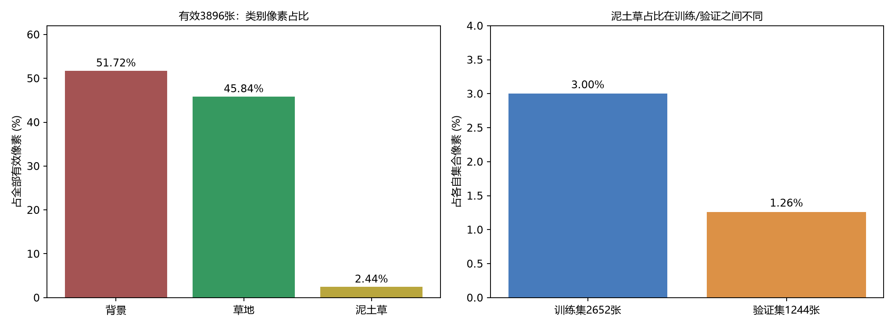
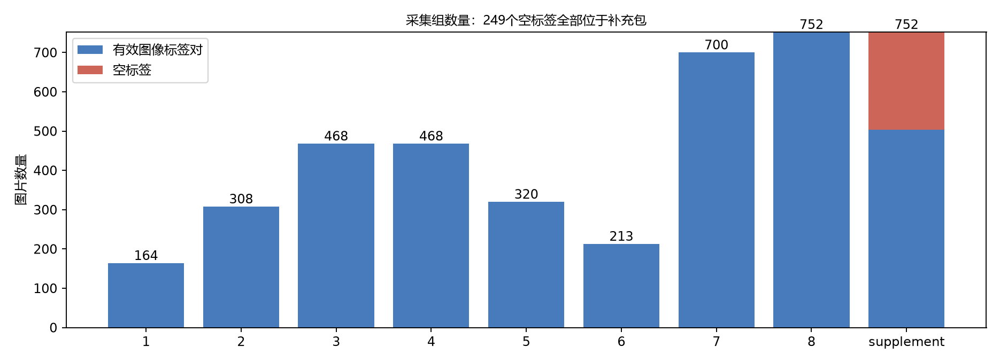
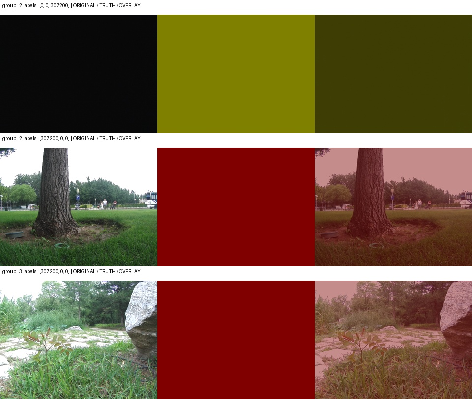

# 草地分割数据集：MD5去重与数据分析

分析日期：2026-10-03。直接只读扫描本地9个原图压缩包及灰度标签压缩包，没有重开云机，没有删除、重标或改变划分。数据结构和像素统计与已归档的训练数据审计完全一致。

## 重复情况

| 检查 | 结果 | 含义 |
|---|---:|---|
| 原图文件MD5相同 | 0组 | 4145张原图没有字节级重复 |
| 解码后RGB像素MD5相同 | 0组 | 没有仅因PNG编码不同而漏掉的像素完全重复 |
| 有效图像+标签对重复 | 0组 | 没有完全相同的有效训练样本对 |
| 非空标签重复 | 1组、2张 | 两个不同原图的标签都是整幅背景，需复核漏标 |
| 有效训练/验证集跨集合完全重复 | 0组 | 本次未发现完全相同图片的划分泄漏 |
| 同图不同有效标签 | 0组 | 未发现重复原图上的标注冲突 |
| 相邻文件名图片dHash≤3 | 16对、32张 | 相似候选，不是MD5重复；不是全部近重复数量 |
| 跨集合dHash≤3 | 0对 | 比较2652×1244=3299088对，当前阈值下未找到候选 |

MD5按每个解压后的PNG文件计算；像素MD5包含解码数组的形状、dtype和像素，排除文件元数据/压缩编码差异。空标签文件有249个，MD5自然相同，但不是有效掩码，不并入上表的标签重复数。CSV保留逐文件原图/标签MD5、像素MD5和采集组。

dHash为9×8灰度缩略图的64位横向差分，汉明距离阈值3。AI查看了12对候选示例，主要是同场景的邻近帧、位置或曝光差异；其中曝光差异可以提供有用训练变化，不建议按哈希直接删除。其他4对仍待人工检查。严格dHash可能漏掉相似图，也不能证明不同集合不存在同场地/同视角关联。当前完全重复原图的可删除数量为0。

## 数据数量与类别

原图4145张、灰度标签4145个，原图均640×480；有效非空标签3896个，尺寸和0/1/2标签值合法。没有同名原图、缺失同名标签、孤立标签或解码错误。**合法编码不意味着标注内容正确**，下文列出3张疑似异常验证标签。

| 采集组 | 原图数 | 有效图像标签对 | 空标签 | 划分 |
|---|---:|---:|---:|---|
| 1 | 164 | 164 | 0 | 训练 |
| 2 | 308 | 308 | 0 | 验证 |
| 3 | 468 | 468 | 0 | 验证 |
| 4 | 468 | 468 | 0 | 验证 |
| 5 | 320 | 320 | 0 | 训练 |
| 6 | 213 | 213 | 0 | 训练 |
| 7 | 700 | 700 | 0 | 训练 |
| 8 | 752 | 752 | 0 | 训练 |
| 补充包 | 752 | 503 | 249 | 训练 |
| 合计 | 4145 | 3896 | 249 | 2652训练/1244验证 |

249个空标签全部来自补充包，占全体原图6.01%，占补充包33.11%。这些原图不等于坏图，应优先人工补标；缺标名单在empty_masks.json。

| 类别 | 总像素 | 全集像素占比 | 含该类的有效图片 | 训练集像素占比 | 验证集像素占比 |
|---|---:|---:|---:|---:|---:|
| 0 背景 | 619002963 | 51.72% | 3895 | 51.66% | 51.84% |
| 1 草地 | 548596841 | 45.84% | 3884 | 45.34% | 46.90% |
| 2 泥土草 | 29251396 | 2.44% | 1090 | 3.00% | 1.26% |

仅27.98%的有效图含泥土草；训练含该类884/2652=33.33%，验证206/1244=16.56%。第2组只有1张包含类别2，且就是下文暗图；第3组57张，第4组148张。泥土草的像素和样本都少，分布在训练/验证之间也不一致，不能只看总体像素准确率。第7/8/补充组占训练有效图片73.72%，应关注训练场景集中和外部场景泛化。





## 3张优先复核的验证样本

见quality_review.jpg：每行依次为原图、标签彩色图、叠加；背景为暗红，泥土草为橄榄色。完整文件名及历史模型表现保存在quality_candidates.json。

1. 第2组 `20240702_193457_612230_24783`：图像几乎全黑，亮度均值8.22/255，RGB最大值20；标签却将307200个像素全部标为泥土草。难以从图像识别真实表面，疑似无信息帧或异常标注，需老师裁定。
2. 第2组 `20240702_193654_987418_26544`：原图有树根和明显草地，标签全部为背景，疑似草地漏标。
3. 第3组 `20240704_202655_95050_2167`：原图有石路旁明显草地，标签也全部为背景；与上一张标签MD5完全一致，原图并不重复，疑似草地漏标。



第一张暗图在已归档基线中，泥土草IoU只有5.81%，289061个真值泥土草像素被预测为草地。全验证集泥土草→草地误分为290800像素，该图贡献99.40%。这是观察到的误分统计，不证明标签的正确语义；它提示不能把所有草/泥土草混淆直接归因于模型能力。这里仍保持原始验证结果，不能为了提高指标自行删图。两张整幅背景标签也会使正常草地预测被统计成误分。

## 场景与标注规则

AI查看了暗光、强光、发红候选和泥土草像素最多的各12张示例。暗光候选可见树荫；强光候选包含明显曝光变化。发红候选主要是枯黄草、露土或偏色，不等价于已覆盖典型红草。没有第3类过曝草标签，不能评价四类分割。

泥土草高占比候选中多张为石板、石子路或硬质铺地；类别2的实际标注内容与名称可能不一致，应让老师明确“泥土草”是否包含这些表面。原图中还有人员、车辆、灌木等，但背景0把它们混在一起，当前标签不能独立统计障碍物类别分布。

## 建议处理顺序

1. 先让老师复核3张疑似异常验证样本，并统一类别2的语义。记录修正前后标签、原因和版本；不要由模型预测反过来自动生成真值。
2. 补齐补充包249个空标签。之后增加真实泥土混草、灌木边界、典型红草及强光的明确标注；抽检现有标签边界。
3. 保留当前三类基线作为旧数据版本证据。如修改验证标签/样本，将所有候选在同一个新版本上重新评测，报告版本差异，不能拿新旧指标直接宣称进步。
4. 原图完全重复为0，无需MD5删除。16对相似帧逐对人工确认是否冗余，曝光差异及安全边界差异应保留；按采集序列/场景整体划分，不随机拆连续帧。
5. 后续训练可预先设计含泥土草样本的采样或损失权重实验，但统一数据、预算与停止规则；先处理标注质量，再判断是否需要换模型。当前没有修改训练配置或重训。

## 文件与复现

- summary.json：总体、分组、划分、质量和重复统计。
- file_manifest.csv：4145行逐图数据、文件/像素MD5，可用Excel查看。
- duplicate_groups.json：确切重复标签及成员，原图各项为空组。
- near_duplicate_candidates.json、cross_split_dhash_candidates.json：候选及跨集合检查。
- quality_candidates.json、quality_review.jpg：优先复核的3张标签。
- empty_masks.json：249张待补标签原图名单。
- scene_*.jpg、near_duplicate_examples.jpg：场景与12对相似图示例。
- SHA256SUMS：本次分析产出校验清单。

在含原始ZIP的工程根目录、安装requirements.txt对应分析依赖的Python环境运行（不需要CUDA）：

```bash
python scripts/analyze_dataset.py --root . --output results/dataset_analysis_20261003 --workers 4 --date 2026-10-03
python scripts/report_dataset_analysis.py --root . --analysis results/dataset_analysis_20261003
```

本次用Codex自带Windows Python的Pillow/numpy完成扫描；matplotlib安装到被Git忽略的artifacts/analysis_deps，报告脚本通过--plot-deps使用，不改系统或自带环境。软件版本见environment.json。报告脚本读已归档基线每图指标作为问题辅助证据，不重新推理、不重训。
